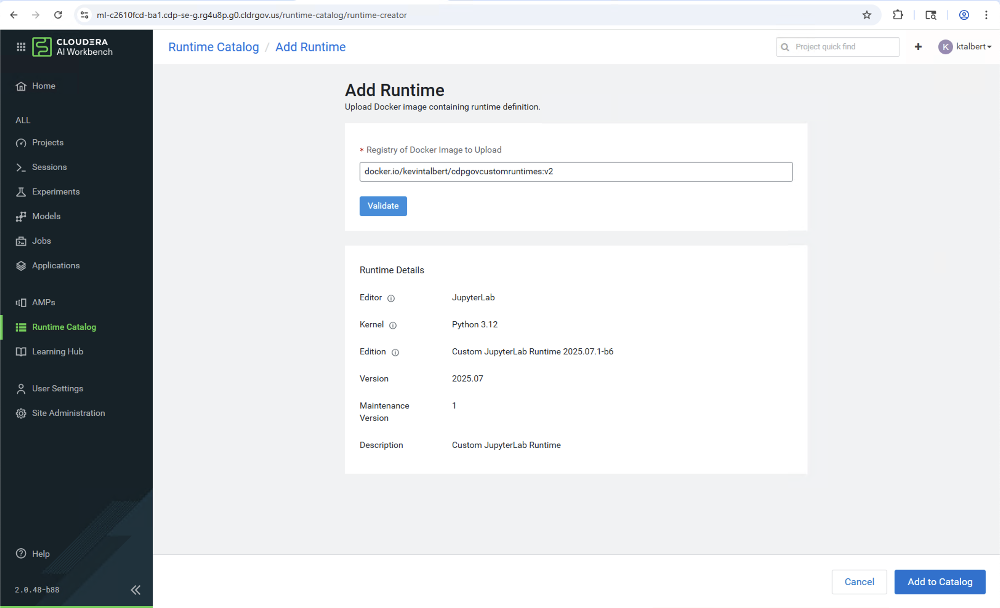

# CDP GovCloud Custom Runtimes

Custom FIPS validated ML Runtime images for Cloudera AI (CAI) in GovCloud environments.

## Available Runtimes

### 1. Agent Studio Runtime
**File:** `Dockerfile.AgentStudio-python312`

A comprehensive runtime for building and deploying Cloudera AI Agent Studio applications in GovCloud.

**Features:**
- **Full Agent Studio Platform**: Clones and builds from [cloudera/CAI_STUDIO_AGENT](https://github.com/cloudera/CAI_STUDIO_AGENT)
- **Python 3.12**: Modern Python with `uv` package manager for fast dependency resolution
- **Node.js 22**: Via NVM for Next.js frontend build
- **Next.js Application**: Production-optimized build included
- **Workflow Engine**: Pre-configured virtual environment for agent workflows
- **Multi-stage Build**: Optimized image size by separating build and runtime stages
- **BusyBox Compatible**: Works with minimal base image without traditional package managers

**Build Commands:**
```bash
# Build latest version (main branch)
docker build --pull --rm \
  -f Dockerfile.AgentStudio-python312 \
  -t kevintalbert/cdpgovcustomruntimes:agentstudio-v2.0.0.61 \
  .
```

**Runtime Metadata:**
- **Edition**: Agent Studio for GovCloud
- **Editor**: JupyterLab
- **Kernel**: Agent Studio
- **Version**: 2.0.0.61

**Use in CAI:**
```
kevintalbert/cdpgovcustomruntimes:agentstudio-v2.0.0.61
```

---

### 2. JupyterLab Runtime
**File:** `Dockerfile.JupyterLab-python312`

A lightweight, standard JupyterLab runtime for general-purpose data science and ML workloads in GovCloud.

**Features:**
- **JupyterLab**: Latest JupyterLab interface
- **Python 3.12**: Modern Python runtime
- **Lightweight**: Minimal additional dependencies
- **Fast Build**: Simple, quick-to-build runtime

**Build Command:**
```bash
docker build --pull --rm \
  -f Dockerfile.JupyterLab-python312 \
  -t kevintalbert/cdpgovcustomruntimes:jupyterlab-python312 \
  .
```

**Runtime Metadata:**
- **Edition**: Custom JupyterLab Runtime 2025.07.1-b6
- **Editor**: JupyterLab
- **Kernel**: Python 3

## Base Image

Both runtimes are based on:
```
container-public.repo.cdp.clouderagovt.com/cloudera-public/cloudera/cdsw/ml-runtime-pbj-workbench-python3.12-govcloud:2025.07.1-b6
```

This is the official Cloudera ML Runtime for GovCloud with Python 3.12 support.

## Building the Images

### Prerequisites
- Docker Desktop or Docker Engine
- Access to Cloudera GovCloud registry: `container-public.repo.cdp.clouderagovt.com`


## Runtime Validation

After building, validate the runtime in CAI:



## Technical Notes

### Base Image Characteristics
- **OS**: Red Hat UBI8 (minimal)
- **Shell**: BusyBox (limited utilities)
- **Package Manager**: None (no apt, yum, dnf, or microdnf)
- **Pre-installed Tools**: Python 3.12, pip, git, curl, gcc, make
- **Architecture**: linux/amd64


## License

See [LICENSE](LICENSE) for details.

